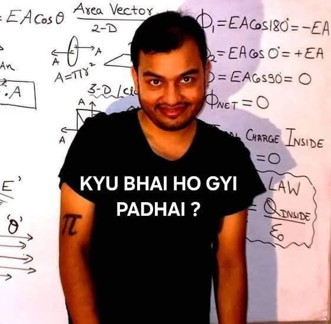

<!DOCTYPE html>
<html lang="hi">
<head>
  <meta charset="UTF-8">
  <meta name="viewport" content="width=device-width, initial-scale=1.0">
  <title>🎆 Happy Diwali 🎆</title>
  
</head>
<body>

  <h1>🎆 Happy Diwali 🎆</h1>
  <button onclick="showPopup()">Tap to collect your gift 🎁</button>

  

     <WhatsApp Image 2025-10-18 at 09.27.32_db61fa98.jpg>
  

  

</body>
</html>
